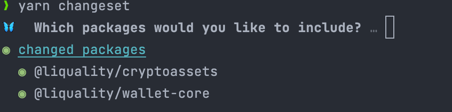
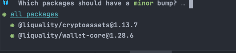

# Wallet Core

<pre>
 _       __      ____     __     ______              
| |     / /___ _/ / /__  / /_   / ____/___  ________ 
| | /| / / __ `/ / / _ \/ __/  / /   / __ \/ ___/ _ \
| |/ |/ / /_/ / / /  __/ /_   / /___/ /_/ / /  /  __/
|__/|__/\__,_/_/_/\___/\__/   \____/\____/_/   \___/ 
</pre>


Wallet Core is a cryptocurrency wallet library in Typescript. It provides an abstracted interface that handles all the necessary internals of a muilti chain wallet. Featuring:

- State management
- Seed management and security
- Account management
- Blockchain communication under a common interface, powered by [Chainify](https://github.com/liquality/chainify)
- Retriving balances
- Sending transactions
- Intra and cross chain swaps supporting a host of decentralised exchanges - Liquality, Thorchain, Uniswap, 1inch, Sovryn, Astroport etc.
- Hardware wallet support

# Install

`npm install @liquality/wallet-core`

`yarn add @liquality/wallet-core`

## Usage

```typescript
import { setupWallet } from '@liquality/wallet-core';
import defaultOptions from '@liquality/wallet-core/dist/walletOptions/defaultOptions'; // Default options

const wallet = setupWallet({
  ...defaultOptions,
});

(async () => {
  await wallet.dispatch.createWallet({
    key: 'satoshi',
    mnemonic: 'never gonna give you up never gonna let you down never gonna',
    imported: true,
  });
  await wallet.dispatch.unlockWallet({ key: 'satoshi' });
  await wallet.dispatch.changeActiveNetwork({ network: 'mainnet' });
  console.log(wallet.state); // State will include default accounts
})();
```

## Options

See `WalletOptions` in [types](src/types.ts)

```typescript
  {
    initialState?: RootState; // The initial state of the wallet
    crypto: { // Implmenetation for platform specific crypto
      pbkdf2(password: string, salt: string, iterations: number, length: number, digest: string): Promise<string>;
      encrypt(value: string, key: string): Promise<any>;
      decrypt(value: any, key: string): Promise<any>;
    };
    // Handle notifications
    createNotification(notification: Notification): void;
    ...
  }
```

## Examples

- [Add Custom Token](src/store/actions/addCustomToken.test.ts)
- [Export Private Key](src/store/actions/exportPrivateKey.test.ts)
- [Send Transaction](src/store/actions/sendTransaction.test.ts)
- [Update Fees](src/store/actions/updateFees.test.ts)
- [Update Balance](src/store/actions/updateBalances.test.ts)

## How to run tests

Integration tests are written in [Jest](https://jestjs.io/).

```angular2html
yarn test
```

## Publish to npm

- GitHub actions will publish to NPM automatically after a successful pull request merge.
  Releases will be listed here: [Releases](https://github.com/liquality/wallet-core/releases)

```
yarn changeset
```





